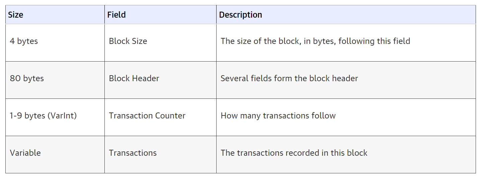
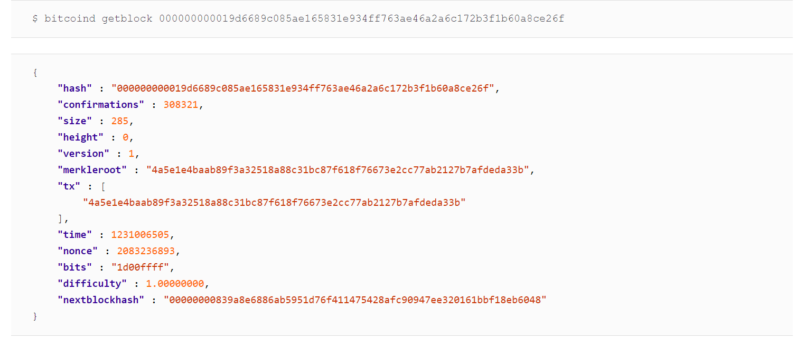
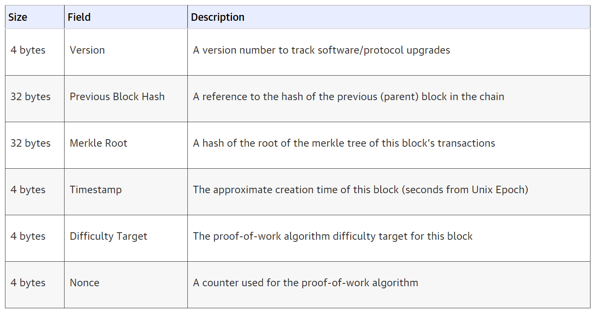

## 2.1 Blockchain definition
***

Emerged from the need of an electronic payment system that will not rely on a trusted third party as a central authority e.g. banks and governments, the blockchain technology is a common discussion topic among tech enthusiasts. First introduced back in 2008 by Satoshi Nakamoto, blockchain seems to address this challenge by proposing a purely peer-to-peer distributed timestamp server solution that generates computational proof of the chronological order of transactions. [[*1, The white paper*]](https://bitcoin.org/bitcoin.pdf) 
What we today know as a blockchain is a growing sequence of records called blocks, designed to be resistant to modification of its data by implementing a cryptographic hashing algorithm. It is an open-source, distributed ledger that allows recording transactions between two parties efficiently and in a verifiable and permanent way. [[*2, The Truth about Blockchain*]](https://hbr.org/2017/01/the-truth-about-blockchain) Each of the blocks contains hashed transactions of the previous block in the blockchain, meaning that it prevents data inconsistency as any change is immediately noticed. [[*3, Wikipedia*]](https://en.wikipedia.org/wiki/Blockchain) This is an essential concept that makes blockchain a revolutionary discovery in a world dependent on traditional fiat systems.

## 2.2 Blockchain Types
***
Up until now there are at least four types of blockchain networks [[4]](https://101blockchains.com/types-of-blockchain/), 
[[5]](https://data-flair.training/blogs/types-of-blockchain/),
[[6]](https://dragonchain.com/blog/differences-between-public-private-blockchains),
[[7]](https://blockstream.com/sidechains.pdf),
[[8]](https://hackernoon.com/13-sidechain-projects-every-blockchain-developer-should-know-about-804b65364107):
- **Public blockchains** - non-restrictive, permission-less distributed ledger system e.g. Bitcoin, Litecoin, Etherium
- **Private blockchains (Distributed Ledger, DLT)** - a restrictive or permission blockchain operative only in a closed network e.g. Multichain, Corda
- **Hybrid blockchains** - a flexible blockchain that implements a combination of centralised and decentralised features e.g. Dragonchain, XinFin.
- **Sidechains** - a blockchain that validates data from other blockchains; runs in parallel with a primary blockchain, but independently of it e.g. Plasma, Liquid.

## 2.3How it works
***
Rather than a completely new technological discovery, Blockchain is considered as a revolutionary innovation thanks to the combination of several existing technologies. According to CoinDesk [[9]](https://www.coindesk.com/learn/blockchain-101/how-does-blockchain-technology-work), the three component technology that make Blockchain when applied jointly are:
1. Private key cryptography
2. A distributed network with a shared ledger
3. The blockchain protocol governing incentivisation

### 2.3.1 Private key cryptography
This type of cryptography uses a pair of a public key and a private key to create a digital identity reference which provides strong control of ownership. Public keys are widely distributed, on the other hand, private keys are kept secret. [[10]](https://medium.com/coinmonks/blockchain-public-private-key-cryptography-in-a-nutshell-b7776e475e7c#:~:text=Blockchain%20makes%20use%20of%20several%20different%20types%20of%20cryptography.&text=Public%20key%20cryptography%20uses%20a,key%20to%20perform%20different%20tasks.&text=Using%20a%20person's%20public%20key,can%20decrypt%20and%20read%20it). For an example, you could think of the public key as your bank account number and the private key as your password which you use to log into your bank account.

This concept achieves the goal to prove that a spent transaction was indeed signed by the owner of the funds, and was not forged, all occurring over a public blockchain network between peers. [[11]](https://www.ledger.com/academy/blockchain/what-are-public-keys-and-private-keys)

### 2.3.2 A distributed network with a shared ledger

While the private key cryptography solves the authentication, authorisation still remains a challenge to be tackled. This is where a distributed network comes in, which enables approval of transactions and permissions. DLT allows data to be stored globally on thousands of servers and lets anyone on the network see all entries in almost near real-time. Therefore, the need of a central authority or intermediary to process and validate transactions i.e. a bank, is eliminated.[[12]](https://www.computerworld.com/article/3191077/what-is-blockchain-the-complete-guide.html)

### 2.3.3 The Blockchain Protocol

Blockchain uses a technique to create and verify a continuously growing, append-only data structure which serves the function of a ledger. New transactions which include encrypted data are collectively determined as valid and added to the block only by a previous confirmation of the block’s validity by all network participants according to a predefined validation algorithm. 
[[13]](https://olc.worldbank.org/system/files/122140-WP-PUBLIC-Distributed-Ledger-Technology-and-Blockchain-Fintech-Notes.pdf)

To simplify the concept and understand it better, we will define the following terms: 
- A **block** is a container data structure that aggregates transactions for inclusion in the public ledger (the blockchain). It contains a digital signature, a timestamp and other relevant information. 
- **Mining** is a process of creating new bitcoin by solving complex mathematical calculation for the network to confirm transactions by high-powered computers. 

The protocol can be elaborated in the following steps: [[14]](https://www.investopedia.com/terms/b/blockchain.asp)
- A new transaction is entered.
- The transaction is transmitted through the network of P2P computers across the world.
- The network participants perform mining calculations to confirm the validity of the transaction.
- Once confirmed, the transaction is complete.
- The blocks are chained together, creating a long history of permanent transactions.
- Once confirmed to be legitimate transactions by consensus, they are clustered into blocks.

Since the blockchain that took the most computing work to generate (the longest version) is considered to be ‘the correct one’, this approach makes it very difficult to control and/or alter the transactions in the network, although not impossible. However, it would take a massive CPU power to hack it - an entity needs to control more than 51% of the total network’s computing (hashing) power. [[15]](https://www.lexology.com/library/detail.aspx?g=bf19a436-52a9-47ea-b2c4-bd9afe4065d6)

Hash rate is a measuring unit of the processing power of the network, i.e. when the network reached a hash rate of 10 Th/s, it meant it could make 10 trillion calculations per second. 
[[16]](https://bitcoin.org/en/vocabulary#cryptography)

The current hash rates for the cryptocurrencies we are comparing at the time of writing are:
- Bitcoin - 142.66M TH/s
- Litecoin - 253.58 TH/s
- Bitcoin cash - 1.28 EH/s

## 2.4 Bitcoin Block Data Structure
***

A block is a container data structure that aggregates transactions for inclusion in the public ledger, the blockchain. The block is made of a header, containing metadata, followed by a long list of transactions that make up the bulk of its size. The block header is 80 bytes, whereas the average transaction is at least 250 bytes and the average block contains more than 500 transactions. A complete block, with all transactions, is therefore 1,000 times larger than the block header. Table 1 describes the structure of a block. [[17]](https://www.researchgate.net/figure/The-data-structure-of-the-Bitcoin-Blockchains_fig1_330351295
)

<figure>

<figcaption text-align="center">
<i>Table 1: Structure of a block.</i>
</figcaption>
    </figure>
    
***
<figure>

<figcaption text-align="center">
<i>Image 1: An example of a parsed bitcoin block</i>
</figcaption>
    </figure>

### 2.4.1 Block Header

The block header consists of the following three sets of block metadata:
- A reference that connects the block hash to the previous block in the blockchain.
- Difficulty, timestamp, and nonce, relate to the mining competition.
- A merkle tree root used to efficiently summarize all the transactions in the block. [18](https://www.datadriveninvestor.com/2019/11/21/a-decomposition-of-the-bitcoin-block-header/#:~:text=The%20Bitcoin%20block%20header%20contains%20important%20information%20inside%20the%20block.&text=The%20block%20headers%20are%20serialized,used%20when%20mining%20for%20Bitcoin)

<figure>

<figcaption text-align="center">
<i>Table 2: Structure of a block header.</i>
</figcaption>
    </figure>
    
    
    
## 2.4.2 Block Identifier 

We can identify a block in the blockchain in the following two ways:
1. ***By referencing its cryptographic hash***
    - Hashing the block header twice through the SHA256 algorithm results with a 32-byte hash which is used as a
primary identifier, to identify a block uniquely and unambiguously and can be independently.
The block’s hash is computed by each node as the block is received from the network. It might be stored in a
separate database table as part of the block’s metadata, to facilitate indexing and faster retrieval of blocks from
disk. Therefore, it is not included in the block’s data structure, neither when the block is transmitted on the
network, nor when it is stored on a node’s persistence storage as part of the blockchain. [[19]](https://www.oreilly.com/library/view/mastering-bitcoin/9781491902639/ch07.html#:~:text=Merkle%20Trees,of%20large%20sets%20of%20data)
The following block hash belongs to the the first bitcoin block ever created:000000000019d6689c085ae165831e934ff763ae46a2a6c172b3f1b60a8ce26f

2. ***By referencing its block height***
    - The first block ever created is at block height 0 (zero). Blocks are stacked like boxes one on top of the other in
the blockchain - each subsequent block added “on top” of that first block is one position “higher”. The position
of the block in the blockchain can be used to identify a block; however, the block height does not always
identify a single block due to the competition of the blocks for the same position in the blockchain.
The block height is also not a part of the block’s data structure; it is not stored within the block. Each node
dynamically identifies a block’s position (height) in the blockchain when it is received from the bitcoin network.
Although it might be stored as metadata in an indexed database table for faster retrieval, the block height is not
a part of the block’s data structure as each node dynamically identifies a height in the blockchain when
received from the bitcoin network.[[19]](https://www.oreilly.com/library/view/mastering-bitcoin/9781491902639/ch07.html#:~:text=Merkle%20Trees,of%20large%20sets%20of%20data)
The block height on January 1, 2014, was approximately 278,000, meaning there were 278,000 blocks stacked
on top of the first block created in January 2009. [[20]](https://www.statista.com/statistics/647523/worldwide-bitcoin-blockchain-size/)

### 2.4.3 The Genesis Block 

The genesis block was created in 2009 and it is statically encoded within the bitcoin client software, such that it
cannot be altered. Therefore, every node uses this common secure root to build a trusted blockchain. If you
start at any block and follow the chain backward in time, you will eventually arrive at the genesis block.[[19]](https://www.oreilly.com/library/view/mastering-bitcoin/9781491902639/ch07.html#:~:text=Merkle%20Trees,of%20large%20sets%20of%20data)

*The genesis block contains a hidden message within it. The coinbase transaction input contains the text “The
Times 03/Jan/2009 Chancellor on brink of second bailout for banks.” - the headline of the British newspaper
The Times used to prove the earliest date this block was created. The message embedded in the first block by
Satoshi Nakamoto also references the importance of an independent monetary system, with bitcoin’s launch
occurring at the same time as an unprecedented worldwide monetary crisis*. [[21]](https://coingeek.com/12-years-since-the-genesis-block-a-reminder-of-what-bitcoin-is-really-about/)

### 2.4.4 Merkle Trees
Each block in the bitcoin blockchain contains a summary of all the transactions in the block, using a merkle
tree. A merkle tree, also known as a binary hash tree, is an effective data structure used for efficiently
summarizing all transactions in a block. The merkle tree is constructed by recursively hashing pairs of nodes,
using the double-SHA256 algorithm until there is only one hash left, called the (merkle) root. [[22]](https://brilliant.org/wiki/merkle-tree/)
When N data elements are hashed and summarized in a merkle tree, you can check to see if any one data
element is included in the tree with at most 2*log2(N) calculations. [[19]](https://www.oreilly.com/library/view/mastering-bitcoin/9781491902639/ch07.html#:~:text=Merkle%20Trees,of%20large%20sets%20of%20data)

<figure align = "center">

    </figure>

