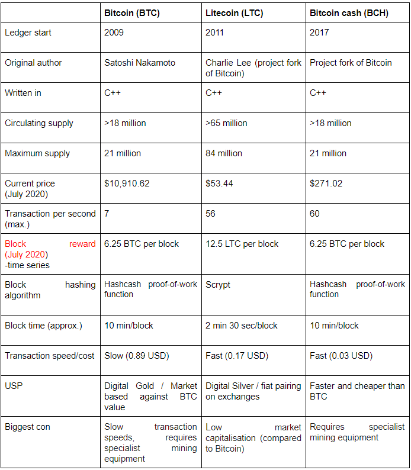

## 3.1 Bitcoin

Bitcoin (BTC) as first described by a person or people called Satoshi Nakamoto in 2008, is a
decentralised digital currency that records transactions in a distributed ledger called a blockchain and it was
released as an open-source software. The blockchain technology behind it, also described in the same paper,
was used as a synonym for Bitcoin at the beginnings.
Today, Bitcoin is the most valuable cryptocurrency on the market and therefore, it is considered the digital
gold. Bitcoins can be exchanged for other currencies, services and products, varying from buying a Starbucks
coffee [[23]](https://www.retaildive.com/ex/mobilecommercedaily/starbucks-integrates-with-bitcoin-wallet-to-allow-app-users-to-pay-with-cryptocurrency#:~:text=Customers%20using%20the%20Starbucks%20app,called%20Bitcoin%20Direct%20to%20Starbucks) to buying a Virgin Galactic trip to outer space. [[24]](https://www.cnbc.com/2019/06/21/tyler-winklevoss-bought-a-virgin-galactic-ticket-to-space-with-bitcoin.html#:~:text=In%20January%2C%202014%2C%20Tyler%20and,time%20was%20%24800%2C%20Winklevoss%20said)
Although many countries around the world, including EU countries and the US have already accepted the use
of Bitcoin, others haven’t. Countries including Ecuador, Bolivia and Egypt have completely banned the usage
of bitcoins. There are also countries that have asked their residents to be careful while using cryptocurrencies
but haven’t completely banned it - however, they do not accept it as legal tender. [[25]](https://en.wikipedia.org/wiki/Legality_of_bitcoin_by_country_or_territory)
The first known commercial Bitcoin transaction was the purchase of 2 Papa John’s pizzas, with 10,000 bitcoin
by the programmer Laszlo Hanyecz on May 22nd, 2010[[26]](https://www.cnbc.com/2018/06/18/blockchain-what-is-it-and-how-does-it-work.html). This transaction is still considered as
the most expensive food order in history and this day is celebrated as ‘Bitcoin Pizza Day’.
One intriguing fact about Bitcoin is that the smallest unit of it is called satoshi, as a reference to its creator. [[27]](https://bitflyer.com/en-eu/glossary/satoshi)
It’s also interesting to note that approximately 23% of the total bitcoin in circulation has been lost by
mishandling of private and public keys, while the largest personal loss of $7,500 USD occurred when James
Howells accidentally threw away his old hard drive. [[28]](https://www.cnbc.com/2017/12/20/man-lost-127-million-worth-of-bitcoins-and-city-wont-let-him-look.html)

## 3.2 Litecoin

Litecoin, (LTC or Ł) is an open-source, P2P cryptocurrency project released under the MIT/X11 license started
in 2011. It was an early bitcoin spinoff or altcoin. Though similar to Bitcoin’s architecture, Litecoin’s structure is
developing away from BTC. For example, the introduction of new opt-in privacy features when sending and
receiving LTC on-chain.
Additional or different features include:
- The memory-intensive Scrypt Proof-of-Work mining algorithm.
- A frequent block generation that is able to confirm transactions faster than Bitcoin.
- Litecoin’s software can be downloaded, used, modified and distributed by anyone, with the independent
verification of binaries and their corresponding source code ensuring data integrity. [[29]](https://mycred.io/what-is-litecoin/)

## 3.3 Bitcoin Cash

Bitcoin Cash, sometimes referred as Bcash, is a cryptocurrency created as a fork of Bitcoin, in August 2017. It
characterises with an increased size of blocks, which allows more transactions to be processed and improves
the scalability. [[30]](https://www.investopedia.com/terms/b/bitcoin-cash.asp)
In November 2018, Bitcoin Cash split into two different cryptocurrencies - Bitcoin Cash and Bitcoin SV

## 3.4 General Comparison

The following table presents the general comparison of the most important features of the three
cryptocurrencies, at the time of writing of this paper (July, 2020). Bitcoin, as the oldest, has the biggest current
price on the market making it a Digital Gold. Bitcoin and Bitcoin Cash use the same hashing algorithm, while
LTC uses a different one.

<figure align = "center">

    </figure>
